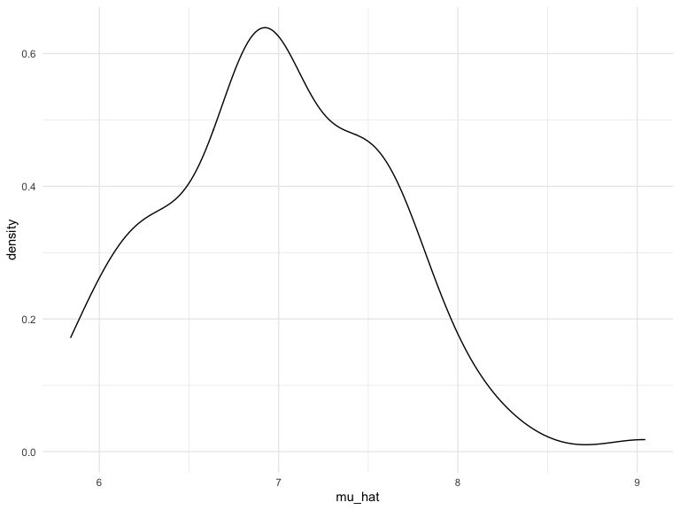
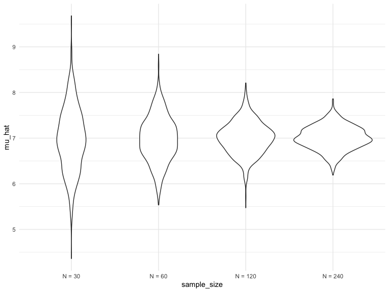
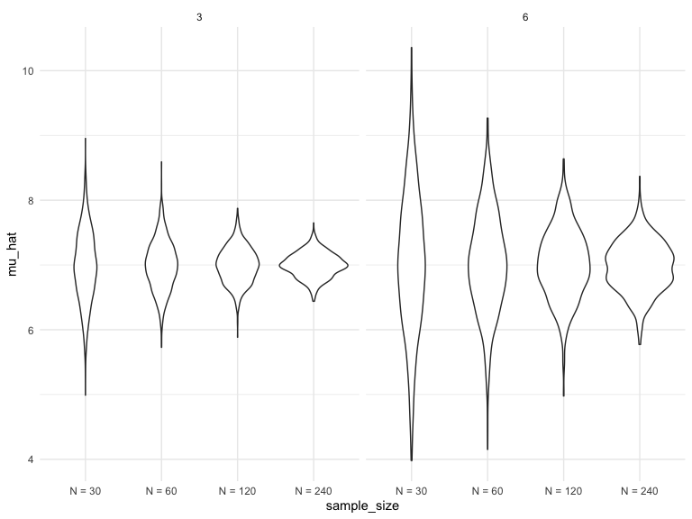

Simulations
================
Elaine Yanxi Chen
2022-11-05

## Packages and settings

First we load the packages necessary to knit this document.

``` r
library(tidyverse)

knitr::opts_chunk$set(
    echo = TRUE,
    warning = FALSE,
    fig.width = 8, 
  fig.height = 6,
  out.width = "90%"
)

theme_set(theme_minimal() + theme(legend.position = "bottom"))

options(
  ggplot2.continuous.colour = "viridis",
  ggplot2.continuous.fill = "viridis"
)

scale_colour_discrete = scale_colour_viridis_d
scale_fill_discrete = scale_fill_viridis_d
```

## Simulations!!

Generate a sample mean from a normal distribution.

Here’s our function from before.

``` r
sim_mean_sd = function(n_obs, mu = 7, sigma = 4) {
  
  x = rnorm(n = n_obs, mean = mu, sd = sigma)

tibble(
  mu_hat = mean(x),
  sigma_hat = sd(x)
)

}
```

How did we use this before?

``` r
sim_mean_sd(n_obs = 30)
```

    ## # A tibble: 1 × 2
    ##   mu_hat sigma_hat
    ##    <dbl>     <dbl>
    ## 1   7.47      3.56

How can we use this now…

Let’s start with a for loop!

``` r
output = vector("list", length = 100)

for (i in 1:100) {
  
  output[[i]] = sim_mean_sd(n_obs = 30)
  
}

bind_rows(output)
```

    ## # A tibble: 100 × 2
    ##    mu_hat sigma_hat
    ##     <dbl>     <dbl>
    ##  1   8.12      4.25
    ##  2   7.29      3.76
    ##  3   6.69      3.39
    ##  4   5.64      4.06
    ##  5   8.09      4.24
    ##  6   7.64      4.72
    ##  7   7.55      4.47
    ##  8   7.96      3.71
    ##  9   7.12      4.23
    ## 10   7.59      4.04
    ## # … with 90 more rows

Let’s use list columns instead.

``` r
sim_results_df = 
  expand_grid(
  sample_size = 30,
  iteration = 1:100
) %>% 
  mutate(
    estimate_df = map(sample_size, sim_mean_sd)
  ) %>% 
  unnest(estimate_df)
```

Map allows us to take each individual element and apply to the same
function over and over again. `sample_size` is the input, `sim_mean_sd`
is the function we apply the input to, and we output to the
`estimate_df` every single time.

Unnest the dataframe allow us to do more stuff with it and further
manipultae the data.

``` r
sim_results_df %>% 
  ggplot(aes(x = mu_hat)) +
  geom_density()
```



Prof gets super excited!!!!!!!!!!!!!!!!!!!!!!

## What about changing the sample size

I need a input list with lots of sample sizes

``` r
sim_results_df = 
  expand_grid(
  sample_size = c(30, 60, 120, 240),
  iteration = 1:1000
) %>% 
  mutate(
    estimate_df = map(sample_size, sim_mean_sd)
  ) %>% 
  unnest(estimate_df)
```

``` r
sim_results_df %>% 
  mutate(
    sample_size = str_c("N = ", sample_size),
    sample_size = fct_inorder(sample_size)
  ) %>% 
  ggplot(aes(x = sample_size, y = mu_hat)) +
  geom_violin()
```



``` r
sim_results_df %>% 
  mutate(
    sample_size = str_c("N = ", sample_size),
    sample_size = fct_inorder(sample_size)
  ) %>% 
  group_by(sample_size) %>% 
  summarize(
    emp_st_err = sd(mu_hat)
  )
```

    ## # A tibble: 4 × 2
    ##   sample_size emp_st_err
    ##   <fct>            <dbl>
    ## 1 N = 30           0.710
    ## 2 N = 60           0.503
    ## 3 N = 120          0.360
    ## 4 N = 240          0.260

## Let’s see two inputs…

``` r
sim_results_df = 
  expand_grid(
  sample_size = c(30, 60, 120, 240),
  true_sigma = c(6, 3),
  iteration = 1:1000
) %>% 
  mutate(
    estimate_df = 
      map2(.x = sample_size, .y = true_sigma, ~sim_mean_sd(n_obs = .x, sigma = .y))
  ) %>% 
  unnest(estimate_df)
```

``` r
sim_results_df %>% 
  mutate(
    sample_size = str_c("N = ", sample_size),
    sample_size = fct_inorder(sample_size)
  ) %>% 
  ggplot(aes(x = sample_size, y = mu_hat)) +
  geom_violin() +
  facet_grid(. ~ true_sigma)
```



Knitting things with simulations can be time-consuming. Solutions
include: \* Running the code with a small sample size and increase it
till later

-   Use `cache = TRUE`; cache means to save the results and no need to
    redownload/rerun every single time. Second time, won’t rerun the
    same code chunk. No rerun until the code inside changes. Could be
    problematic if the code chunk depends on a previous code chunk since
    r wouldn’t know that and wouldn’t rerun the code.
